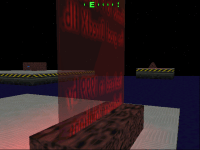



## Eye3D \- Direct3D IM Demo

### Description

Accessing DirectDraw, Direct3D Immediate Mode and DirectSound * 16-bit color depth * first person 3D viewport * viewport HUD display * backbuffering and page flipping * color key transparency * alpha translucency * darklight shadow effects * animated textures * hardcoded decal handling * dynamic lighting * Detection of hardware accellerators including 3DFX cards * 3D wave audio * extensively documented * freeware
 
### More Info
 
WARING: This demo dates back to 1999 and uses a type library by P.Scribe to access DirectX, not Microsofts official DirectX for VB support. Never the less, you should be able to adapt the basics easily.

             |
---                |---
**Submitted On**   |1999-02-13 19:28:46
**By**             |[Wolfgang Kienreich](https://github.com/Planet-Source-Code/PSCIndex/blob/master/ByAuthor/wolfgang-kienreich.md)
**Level**          |Advanced
**User Rating**    |5.0 (35 globes from 7 users)
**Compatibility**  |VB 6\.0
**Category**       |[DirectX](https://github.com/Planet-Source-Code/PSCIndex/blob/master/ByCategory/directx__1-44.md)
**World**          |[Visual Basic](https://github.com/Planet-Source-Code/PSCIndex/blob/master/ByWorld/visual-basic.md)
**Archive File**   |[CODE\_UPLOAD9636952000\.zip](https://github.com/Planet-Source-Code/wolfgang-kienreich-eye3d-direct3d-im-demo__1-11269/archive/master.zip)

